# Repository Documentation


## Repository Architecture

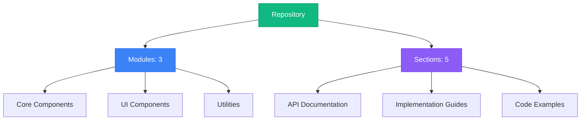

## Table of Contents

### 1. Recoil State Management

No description available

**Sections:**


**1.** Recoil Atoms for Global State Management in the Frontend

---

### 2. Secure Authentication and API Integration

No description available

**Sections:**


**1.** Signup Password Input: Capturing and Storing User Passwords with Recoil

**2.** StudySpace API Endpoints: User Authentication, Space Management, and Data Retrieval

---

### 3. Space Data Management: Schemas, Retrieval, and Rendering

No description available

**Sections:**


**1.** Displaying Joined Spaces: Fetching and Rendering User-Specific Spaces with Recoil State Management

**2.** Mongoose Schema Definitions and Automated Expiry for 'Spaces' with Timezone Handling

---


## Navigation Guide

- **Modules**: Browse through organized code modules in the left sidebar
- **Sections**: Each module contains multiple documentation sections
- **Search**: Use the search bar to quickly find specific content
- **Headings**: Use the right sidebar to navigate within long documents
- **Actions**: Copy or download any section content using the toolbar buttons

# Frontend Application: State Management with Recoil

This document provides a comprehensive guide to the frontend application's state management system, built using Recoil. It covers the architecture, workflows, usage, and important implementation details to help developers understand and contribute to the project effectively.

## Overview

The frontend application utilizes Recoil for managing global state. Recoil allows components to subscribe to state and update it in a fine-grained manner, leading to efficient re-renders and a more predictable data flow. The core of the state management resides in `frontend/src/pages/store/store.tsx`, which defines various atoms that hold different pieces of application state.

## Architecture

The application's state is divided into several categories, each managed by a set of Recoil atoms. These categories include:

*   **General Atoms:** Authentication status, user information, and message display.
*   **Spaces Atoms:** Lists of spaces, joined spaces, and created spaces.
*   **Signup Atoms:** Data for the signup form.
*   **Signin Atoms:** Data for the signin form.
*   **OTP Atoms:** Data related to OTP verification.
*   **Space Details Atoms:** Data for creating and displaying space details.

### `frontend/src/pages/store/store.tsx` - Core State Definitions

This file defines the Recoil atoms that store the application's state. Each atom is a piece of state that components can subscribe to.

```typescript
import { atom } from "recoil";

// General Atoms
export const user_rollnumber = atom<string>({
  key: "rollNo",
  default: "",
});

export const is_authenticated = atom<boolean>({
  key: "is_authenticated",
  default: false,
});

export const generate_message = atom<boolean>({
  key: "generate_message",
  default: false,
});

export const message_status = atom<boolean>({
  key: "message_status",
  default: false,
});

export const message = atom<string>({
  key: "message",
  default: "",
});

export const email_sent = atom<boolean>({
  key: "email_sent",
  default: false,
});

// Spaces Atoms
export interface Space {
  _id: string;
  Title: string;
}

export const spaces = atom<Space[]>({
  key: "spaces",
  default: [],
});

export const joinedSpaces = atom<Space[]>({
  key: "joinedspaces",
  default: [],
});

export const CreatedSpaces = atom<Space[]>({
  key: "CreatedSpaces",
  default: [],
});

// Signup Atoms
export const signupUsername = atom<string>({
  key: "signupUsername",
  default: "",
});

export const signupEmail = atom<string>({
  key: "signupEmail",
  default: "",
});

export const signupPassword = atom<string>({
  key: "signupPassword",
  default: "",
});

// Signin Atoms
export const signinEmail = atom<string>({
  key: "signinEmail",
  default: "",
});

export const signinPassword = atom<string>({
  key: "signinPassword",
  default: "",
});

// OTP Atoms
export const otp = atom<string>({
  key: "otp",
  default: "",
});

export const otp_try_count = atom<number>({
  key: "otp_try_count",
  default: 0,
});

// Space Details Atoms
export const space_title = atom<string>({
  key: "space_title",
  default: "",
});

export const space_description = atom<string>({
  key: "space_description",
  default: "",
});

export const space_subject = atom<string>({
  key: "space_subject",
  default: "",
});

export const space_venue = atom<string>({
  key: "space_venue",
  default: "",
});

export const space_from_time = atom<Date>({
  key: "space_from_time",
  default: new Date(), // Changed to Date
});

export const space_to_time = atom<Date>({
  key: "space_to_time",
  default: new Date(), // Changed to Date
});

export const ButtonStatus = atom<string>({
  key: "ButtonStatus",
  default: "Join Spaces",
});
```

## Workflows and Data Flows

### 1. User Signup Workflow

This workflow describes the steps involved in a user signing up for the application.

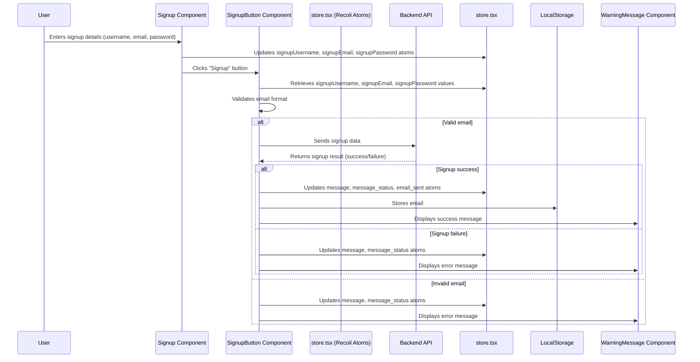

**Explanation:**

1.  The user enters their signup details in the `Signup` component.
2.  The `Signup` component updates the corresponding Recoil atoms (`signupUsername`, `signupEmail`, `signupPassword`) in `store.tsx`.
3.  When the user clicks the "Signup" button, the `SignupButton` component retrieves the values from these atoms.
4.  The `SignupButton` component validates the email format.
5.  If the email is valid, the component sends the signup data to the backend API.
6.  The backend API returns a signup result (success or failure).
7.  Based on the result, the `SignupButton` component updates the `message`, `message_status`, and `email_sent` atoms in `store.tsx` and displays a corresponding message using the `WarningMessage` component.

### 2. OTP Verification Workflow

This workflow describes the steps involved in verifying the OTP sent to the user's email.

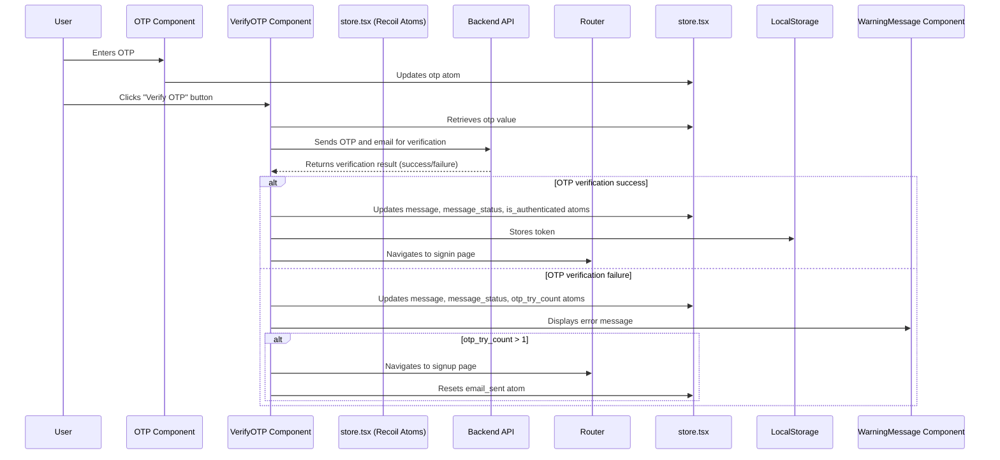

**Explanation:**

1.  The user enters the OTP in the `OTP` component.
2.  The `OTP` component updates the `otp` atom in `store.tsx`.
3.  When the user clicks the "Verify OTP" button, the `VerifyOTP` component retrieves the OTP value from the `otp` atom.
4.  The component sends the OTP and email to the backend API for verification.
5.  The backend API returns a verification result (success or failure).
6.  Based on the result, the `VerifyOTP` component updates the `message`, `message_status`, and `is_authenticated` atoms in `store.tsx`, stores the token in local storage, and navigates to the signin page.
7.  If the OTP verification fails, the component updates the `message`, `message_status`, and `otp_try_count` atoms and displays an error message. If the `otp_try_count` exceeds 1, the component navigates back to the signup page and resets the `email_sent` atom.

### 3. Spaces Display Workflow

This workflow describes how spaces are fetched and displayed on the homepage.

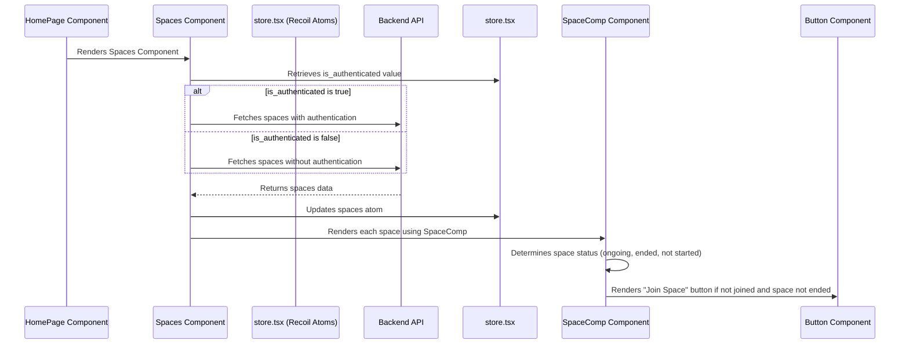

**Explanation:**

1.  The `HomePage` component renders the `Spaces` component.
2.  The `Spaces` component retrieves the `is_authenticated` value from the `store.tsx`.
3.  Based on the `is_authenticated` value, the component fetches spaces from the backend API with or without authentication.
4.  The backend API returns the spaces data.
5.  The `Spaces` component updates the `spaces` atom in `store.tsx`.
6.  The component renders each space using the `SpaceComp` component.
7.  The `SpaceComp` component determines the space status (ongoing, ended, or not started) and renders a "Join Space" button if the user has not joined the space and the space has not ended.

### 4. Creating a New Space Workflow

This workflow describes the steps involved in creating a new space.

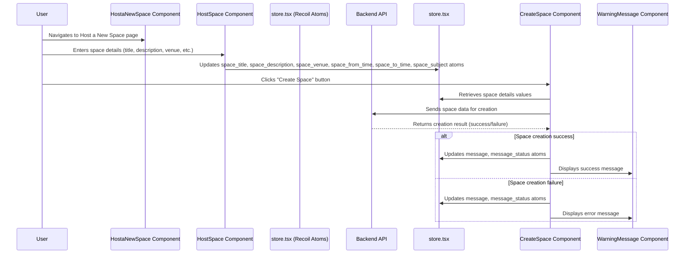

**Explanation:**

1.  The user navigates to the "Host a New Space" page.
2.  The user enters the space details (title, description, venue, etc.) in the `HostSpace` component.
3.  The `HostSpace` component updates the corresponding Recoil atoms (`space_title`, `space_description`, `space_venue`, `space_from_time`, `space_to_time`, `space_subject`) in `store.tsx`.
4.  When the user clicks the "Create Space" button, the `CreateSpace` component retrieves the values from these atoms.
5.  The component sends the space data to the backend API for creation.
6.  The backend API returns a creation result (success or failure).
7.  Based on the result, the `CreateSpace` component updates the `message` and `message_status` atoms in `store.tsx` and displays a corresponding message using the `WarningMessage` component.

## Code Examples

### 1. Using Recoil Atoms in a Component

The following example demonstrates how to use Recoil atoms in the `SignupButton` component to retrieve signup data and display messages.

```typescript
import { useRecoilValue, useSetRecoilState } from "recoil";
import {
  email_sent,
  generate_message,
  message,
  message_status,
  signupEmail,
  signupPassword,
  signupUsername,
} from "../../store/store";
import { USER_SIGNUP_API } from "../../apis/apis";
import { useState } from "react";

export default function SignupButton() {
  const username = useRecoilValue(signupUsername);
  const email = useRecoilValue(signupEmail);
  const password = useRecoilValue(signupPassword);

  const setGenerateMessage = useSetRecoilState(generate_message);
  const setMessage = useSetRecoilState(message);
  const setMessageStatus = useSetRecoilState(message_status);
  const setEmailSent = useSetRecoilState(email_sent);
  const [isHovered, setIsHovered] = useState(false);

  const displayMessage = (msg: string, isSuccess: boolean) => {
    setMessage(msg);
    setMessageStatus(isSuccess); // true = success (green), false = error (red)
    setGenerateMessage(true);

    setTimeout(() => {
      setGenerateMessage(false);
      setMessage("");
      setMessageStatus(true); // reset to green after timeout
    }, 3000);
  };

  const sendDataToBackend = async () => {
    if (!email.includes("@iitb.ac.in")) {
      displayMessage("We are currently available in only IITB!", false);
      return;
    }
    if (!email.includes("@")) {
      displayMessage(
        "Invalid email address. Please enter a valid email.",
        false
      );
    } else {
      displayMessage("Processing your signup request...", true);
      try {
        const data = { username, email, password };
        const response = await fetch(USER_SIGNUP_API, {
          method: "POST",
          headers: {
            "Content-Type": "application/json",
          },
          body: JSON.stringify(data),
        });
        const result = await response.json();
        if (result.success) {
          localStorage.setItem("email", JSON.stringify(email));
          displayMessage(result.msg, result.success);
          setEmailSent(true);
        } else {
          displayMessage(result.msg, result.success);
        }
      } catch (error) {
        displayMessage(
          "Error sending data to the backend. Please try again later." + error,
          false
        );
      }
    }
  };

  return (
    <button onClick={sendDataToBackend}>
      Signup
    </button>
  );
}
```

### 2. Updating Recoil Atoms

The following example demonstrates how to update Recoil atoms in the `OTPInput` component when the user enters the OTP.

```typescript
import { useSetRecoilState } from "recoil";
import { otp } from "../../store/store";
import { useState } from "react";

export default function OTPInput() {
  const setOTP = useSetRecoilState(otp);
  const [isFocused, setIsFocused] = useState(false);
  const OTPHandler = (event: React.ChangeEvent<HTMLInputElement>) => {
    setOTP(event.target.value);
  };

  return (
    <input type="text" onChange={OTPHandler} />
  );
}
```

### 3. Displaying Messages Using Recoil State

The `WarningMessage` component uses Recoil atoms to display messages to the user.

```typescript
import { useRecoilState, useRecoilValue } from "recoil";
import { generate_message, message, message_status } from "../store/store";
import { useState, useEffect } from "react";

export default function WarningMessage() {
  const messageBackground = useRecoilValue(message_status); // true/false
  const [messageVisibility, setVisibility] = useRecoilState(generate_message); // true/false
  const messageValue = useRecoilValue(message); // message content
  const [visible, setVisible] = useState(false);

  useEffect(() => {
    if (messageVisibility) {
      setVisible(true);
      const timer = setTimeout(() => {
        setVisible(false);
        setVisibility(false);
      }, 3000);
      return () => clearTimeout(timer);
    } else {
      setVisible(false);
    }
  }, [messageVisibility, setVisibility]);

  return (
    visible && (
      <div style={{ backgroundColor: messageBackground ? "green" : "red" }}>
        {messageValue}
      </div>
    )
  );
}
```

## Usage Guide

### 1. Accessing State

To access state managed by Recoil, use the `useRecoilValue` hook. This hook takes a Recoil atom as an argument and returns the current value of the atom.

```typescript
import { useRecoilValue } from "recoil";
import { myAtom } from "./store";

function MyComponent() {
  const myValue = useRecoilValue(myAtom);

  return <div>{myValue}</div>;
}
```

### 2. Updating State

To update state managed by Recoil, use the `useSetRecoilState` hook. This hook takes a Recoil atom as an argument and returns a function that can be used to update the value of the atom.

```typescript
import { useSetRecoilState } from "recoil";
import { myAtom } from "./store";

function MyComponent() {
  const setMyValue = useSetRecoilState(myAtom);

  const handleClick = () => {
    setMyValue("new value");
  };

  return <button onClick={handleClick}>Update Value</button>;
}
```

### 3. Subscribing to State Changes

To subscribe to state changes, use the `useRecoilState` hook. This hook takes a Recoil atom as an argument and returns an array containing the current value of the atom and a function to update the value.

```typescript
import { useRecoilState } from "recoil";
import { myAtom } from "./store";

function MyComponent() {
  const [myValue, setMyValue] = useRecoilState(myAtom);

  const handleClick = () => {
    setMyValue("new value");
  };

  return (
    <div>
      {myValue}
      <button onClick={handleClick}>Update Value</button>
    </div>
  );
}
```

## Implementation Details and Gotchas

### 1. Atom Keys

Each Recoil atom must have a unique key. This key is used to identify the atom and is required when creating the atom.

```typescript
export const myAtom = atom<string>({
  key: "myAtomKey", // Unique key
  default: "",
});
```

### 2. Immutability

Recoil encourages immutability. When updating state, create a new object or array instead of modifying the existing one.

### 3. Performance Considerations

Recoil is designed to be performant, but it's important to avoid unnecessary re-renders. Use selectors to derive state and memoize components to prevent re-renders when the input props haven't changed.

## Common Issues and Troubleshooting

### 1. Component Not Re-rendering

If a component is not re-rendering when the state changes, ensure that the component is subscribing to the correct Recoil atom and that the atom is being updated correctly.

### 2. Incorrect State Value

If a component is displaying an incorrect state value, ensure that the component is accessing the correct Recoil atom and that the atom is being initialized with the correct default value.

### 3. Performance Issues

If the application is experiencing performance issues, use the Recoil DevTools to identify components that are re-rendering frequently and optimize them.

## Advanced Configuration and Customization Options

### 1. Selectors

Selectors are derived state. They are functions that take Recoil atoms as input and return a derived value. Selectors are memoized, so they only re-evaluate when their input atoms change.

```typescript
import { selector } from "recoil";
import { myAtom } from "./store";

export const mySelector = selector({
  key: "mySelectorKey",
  get: ({ get }) => {
    const myValue = get(myAtom);
    return myValue.toUpperCase();
  },
});
```

### 2. Effects

Effects allow you to perform side effects when the state changes. For example, you can use effects to persist state to local storage or to log state changes.

## Performance Considerations and Optimization Strategies

### 1. Memoization

Use `React.memo` to memoize components and prevent unnecessary re-renders.

### 2. Selectors

Use selectors to derive state and prevent components from subscribing to atoms that they don't need.

### 3. Batch Updates

Use `useRecoilTransaction` to batch updates and prevent unnecessary re-renders.

## Security Implications and Best Practices

### 1. Data Validation

Validate data before storing it in Recoil atoms to prevent security vulnerabilities.

### 2. Access Control

Implement access control to prevent unauthorized users from accessing or modifying state.

### 3. Secure Storage

Store sensitive data securely using encryption or other security measures.

This documentation provides a comprehensive overview of the frontend application's state management system using Recoil. By following the guidelines and best practices outlined in this document, developers can effectively manage state and contribute to the project.

## Authentication and Password Management System Documentation

This document provides a comprehensive overview of the authentication and password management system, covering both signup and sign-in processes. It details the components involved, their interactions, data flows, and security considerations.

### System Overview

The authentication system handles user registration (signup) and login (signin) functionalities. It includes frontend components for capturing user input (email, username, password) and backend middleware for validating input, checking for existing users, securely storing passwords, and generating/verifying authentication tokens (JWT). The system prioritizes security by using bcrypt for password hashing and JWTs for session management. Email verification is also implemented during signup.

### Component Architecture

The system comprises the following key components:

*   **Frontend Components:**
    *   `frontend/src/pages/Signup/components/password-input.tsx`: Captures the user's password during signup.
    *   `frontend/src/pages/Signin/password-input.tsx`: Captures the user's password during signin.
*   **Backend Middleware:**
    *   `backend/routes/user/middlewares/signUpAuthHelpers.ts`: Handles signup-related logic, including input validation, user existence checks, security code generation and verification via email.
    *   `backend/routes/user/middlewares/signInAuthHelpers.ts`: Handles signin-related logic, including input validation, fetching user data, and password comparison.
    *   `backend/routes/user/middlewares/authMiddleware.ts`: Authenticates users based on JWT tokens.
*   **Database:**
    *   `../../../db/db`: Interacts with the database to store and retrieve user information. (Note: The actual database implementation is not provided in the given code snippets, but it's assumed to exist and is referenced as `Users`).

### Data Flow and Workflows

#### 1. Signup Workflow

This workflow describes the user signup process, from inputting information on the frontend to storing the user in the database.

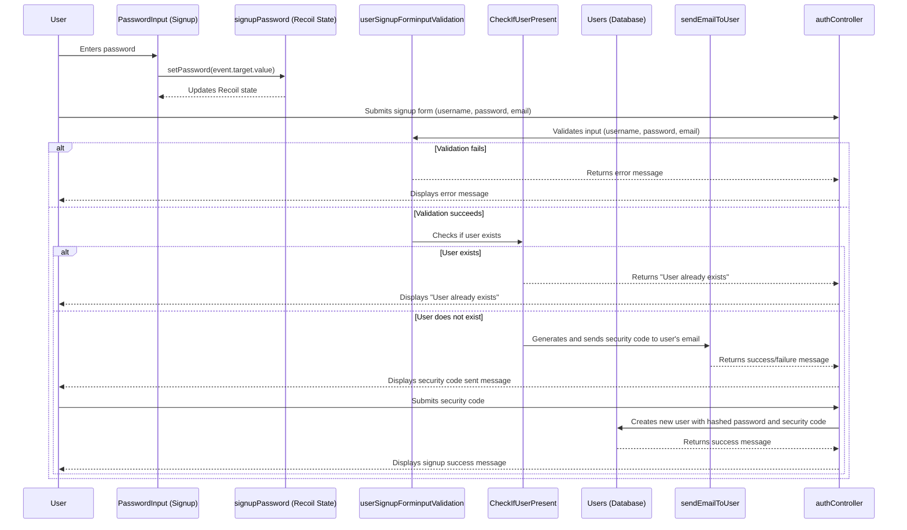

**Explanation:**

1.  The user enters their password in the `PasswordInput` component on the signup page.
2.  The `PasswordHandler` function updates the `signupPassword` Recoil state with the entered password.
3.  The user submits the signup form, which sends the username, password, and email to the backend.
4.  The `userSignupForminputValidation` middleware validates the input data against a Zod schema.
5.  If validation fails, an error message is returned to the user.
6.  If validation succeeds, the `CheckIfUserPresent` middleware checks if a user with the given email already exists in the database.
7.  If the user exists, an error message is returned to the user.
8.  If the user does not exist, the `sendEmailToUser` function generates a security code and sends it to the user's email address.
9.  The user submits the security code to the backend.
10. The backend creates a new user in the database with the provided information, including the hashed password and security code.

#### 2. Signin Workflow

This workflow describes the user signin process, from inputting information on the frontend to generating a JWT token.

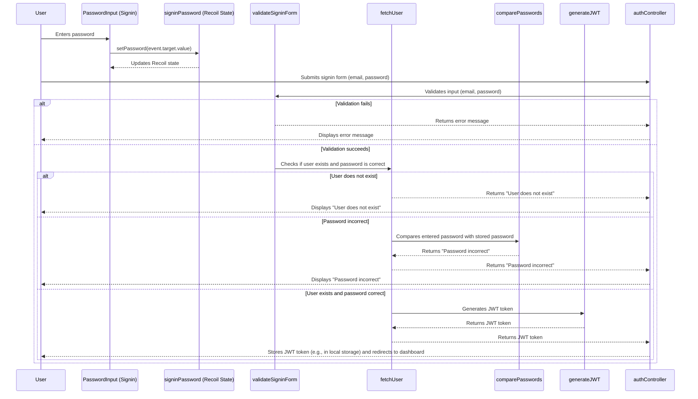

**Explanation:**

1.  The user enters their password in the `PasswordInput` component on the signin page.
2.  The `PasswordHandler` function updates the `signinPassword` Recoil state with the entered password.
3.  The user submits the signin form, which sends the email and password to the backend.
4.  The `validateSigninForm` middleware validates the input data against a Zod schema.
5.  If validation fails, an error message is returned to the user.
6.  If validation succeeds, the `fetchUser` middleware checks if a user with the given email exists in the database and if the provided password matches the stored password.
7.  If the user does not exist or the password is incorrect, an error message is returned to the user.
8.  If the user exists and the password is correct, the `generateJWT` function generates a JWT token.
9.  The JWT token is returned to the user, who then stores it (e.g., in local storage) and is redirected to the dashboard.

#### 3. Authentication Workflow

This workflow describes how the `authMiddleware` is used to protect routes.

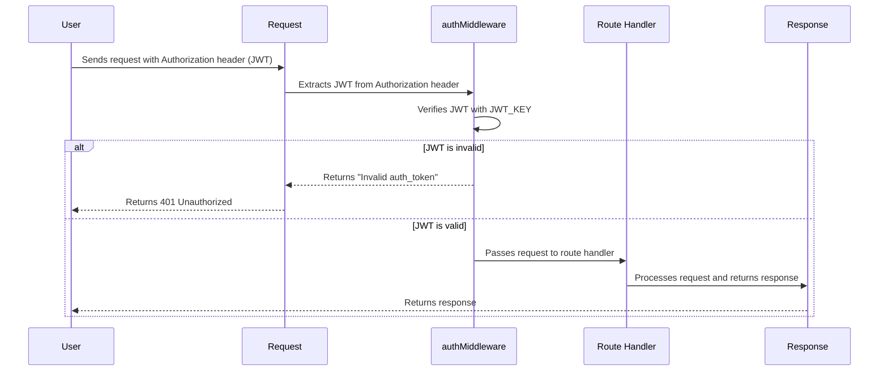

**Explanation:**

1.  The user sends a request to a protected route with the JWT token in the `Authorization` header.
2.  The `authMiddleware` extracts the JWT token from the `Authorization` header.
3.  The `authMiddleware` verifies the JWT token using the `JWT_KEY` environment variable.
4.  If the JWT token is invalid, an error message is returned to the user.
5.  If the JWT token is valid, the request is passed to the route handler.
6.  The route handler processes the request and returns a response to the user.

### Code Examples

#### Password Input Component (Signup)

```typescript
import { useSetRecoilState } from "recoil";
import { signupPassword } from "../../store/store";
import { useState } from "react";

export default function PasswordInput() {
  const setPassword = useSetRecoilState(signupPassword);
  const [isFocused, setIsFocused] = useState(false);
  const PasswordHandler = (event: React.ChangeEvent<HTMLInputElement>) => {
    setPassword(event.target.value);
  };

  // ... (JSX for the input field)
}
```

This component uses Recoil to manage the signup password state.  The `PasswordHandler` function is triggered on input change and updates the `signupPassword` Recoil state.

#### User Signup Input Validation Middleware

```typescript
import { Request, Response, NextFunction, RequestHandler } from "express";
import zod from "zod";

export const userSignupForminputValidation: RequestHandler = (
  req: Request,
  res: Response,
  next: NextFunction
) => {
  const { username, password, email } = req.body;
  const signupInputs = { username, password, email };

  const zodSchemaforValidation = zod.object({
    username: zod
      .string()
      .min(6, { message: "Username must be at least 6 characters long." }),
    password: zod
      .string()
      .min(8, { message: "Password must be at least 8 characters long." }),
    email: zod.string().email({ message: "Invalid email address." }),
  });

  const verification = zodSchemaforValidation.safeParse(signupInputs);

  if (verification.success) {
    console.log("Inputs Validated");
    next();
  } else {
    // ... (Error handling)
  }
};
```

This middleware uses Zod to validate the signup form input. It checks if the username is at least 6 characters long, the password is at least 8 characters long, and the email is a valid email address. If the validation fails, it returns an error message to the client.

#### JWT Authentication Middleware

```typescript
import { NextFunction, Request, Response } from "express";
import jwt from "jsonwebtoken";
import dotenv from "dotenv";
dotenv.config();

export const authMiddleware = async (
  req: Request,
  res: Response,
  next: NextFunction
) => {
  const authorization = req.headers.authorization;
  if (!authorization) {
    return res.json({
      msg: "Fatal : Missing Authorization header",
    });
  }
  const token = authorization?.split(" ")[1];
  if (!process.env.JWT_KEY) {
    throw new Error("Fatal : Missing JWT_KEY in the dotenv");
  }
  try {
    const response = await jwt.verify(token, process.env.JWT_KEY);
    if (response) {
      next();
    }
  } catch (e) {
    return res.json({
      msg: "Fatal : while verifying auth_token",
    });
  }
};
```

This middleware verifies the JWT token in the `Authorization` header. It checks if the `Authorization` header exists, extracts the token, and verifies it using the `JWT_KEY` environment variable. If the token is invalid, it returns an error message to the client. If the token is valid, it calls the `next()` function to pass the request to the next middleware or route handler.

### Usage Guide

#### Signup

1.  The user navigates to the signup page.
2.  The user enters their username, email, and password in the respective input fields.
3.  The user submits the signup form.
4.  The frontend sends a request to the backend with the user's information.
5.  The backend validates the input data and checks if the user already exists.
6.  If the user does not exist, the backend generates a security code and sends it to the user's email address.
7.  The user enters the security code in the provided field.
8.  The frontend sends a request to the backend with the security code.
9.  The backend verifies the security code and creates a new user in the database.
10. The user is redirected to the signin page or automatically signed in.

#### Signin

1.  The user navigates to the signin page.
2.  The user enters their email and password in the respective input fields.
3.  The user submits the signin form.
4.  The frontend sends a request to the backend with the user's email and password.
5.  The backend validates the input data and checks if the user exists in the database.
6.  If the user exists, the backend compares the provided password with the stored password.
7.  If the passwords match, the backend generates a JWT token and sends it to the frontend.
8.  The frontend stores the JWT token (e.g., in local storage) and redirects the user to the dashboard.

#### Protecting Routes

1.  The frontend sends a request to a protected route with the JWT token in the `Authorization` header.
2.  The `authMiddleware` verifies the JWT token.
3.  If the JWT token is valid, the request is passed to the route handler.
4.  If the JWT token is invalid, an error message is returned to the user.

### Implementation Details and Gotchas

*   **Password Hashing:** The system uses `bcrypt` to hash passwords before storing them in the database. This is crucial for security, as it prevents attackers from obtaining the passwords even if they gain access to the database.
*   **JWT Expiration:** JWT tokens should have an expiration time to limit their validity. This reduces the risk of tokens being used if they are compromised.  The code provided does not explicitly set an expiration. This should be configured.
*   **Environment Variables:** Sensitive information such as the JWT key (`JWT_KEY`), email sender address, and email sender password should be stored in environment variables and not directly in the code.
*   **Recoil State Management:** The frontend uses Recoil for state management. Understanding Recoil concepts like atoms and selectors is essential for working with the frontend components.
*   **Zod Validation:** The backend uses Zod for input validation.  Zod schemas should be carefully defined to ensure that all required fields are present and have the correct data types.

### Common Issues and Troubleshooting

*   **"Missing Authorization header"**: This error indicates that the `Authorization` header is not present in the request. Ensure that the frontend is sending the JWT token in the `Authorization` header.
*   **"Invalid auth_token"**: This error indicates that the JWT token is invalid. This could be due to an expired token, a tampered token, or an incorrect `JWT_KEY`.
*   **"User already exists"**: This error indicates that a user with the given email address already exists in the database.  The user should try signing in instead.
*   **"Check your password again"**: This error indicates that the provided password does not match the stored password. The user should try entering their password again.
*   **Email Sending Issues:** If the security code email is not being sent, check the email sender address and password in the environment variables. Also, ensure that the email service provider is configured correctly.

### Advanced Configuration and Customization Options

*   **JWT Expiration Time:** The JWT expiration time can be configured by setting the `expiresIn` option when generating the JWT token.
*   **Password Hashing Rounds:** The number of hashing rounds used by `bcrypt` can be configured to increase the security of the passwords.  Higher rounds increase computation time.
*   **Email Template:** The email template used for sending the security code can be customized to match the branding of the application.
*   **Zod Schemas:** The Zod schemas used for input validation can be customized to add or remove validation rules.

### Performance Considerations and Optimization Strategies

*   **Database Queries:** Optimize database queries to reduce the load on the database server. Use indexes to speed up queries.
*   **Caching:** Cache frequently accessed data to reduce the number of database queries.
*   **JWT Verification:** JWT verification can be computationally expensive. Cache the results of JWT verification to reduce the load on the server.

### Security Implications and Best Practices

*   **Password Storage:** Always use `bcrypt` or a similar password hashing algorithm to store passwords securely.
*   **JWT Security:** Protect the `JWT_KEY` environment variable.  If the `JWT_KEY` is compromised, attackers can generate valid JWT tokens and gain unauthorized access to the system.
*   **Input Validation:** Always validate user input to prevent injection attacks.
*   **Rate Limiting:** Implement rate limiting to prevent brute-force attacks.
*   **Regular Security Audits:** Conduct regular security audits to identify and fix vulnerabilities.

## StudySpace API: Technical Documentation

This document provides a comprehensive overview of the StudySpace API, covering user authentication, space management, and data retrieval. It details the system's architecture, workflows, implementation, and usage, aiming to equip developers with the knowledge to effectively integrate and maintain the platform.

### 1. System Overview

The StudySpace API facilitates user management and collaborative study space organization. It provides endpoints for user registration, authentication, and space creation/management. The API is built using Express.js on the backend and utilizes a React-based frontend. The core functionality includes:

*   **User Authentication:** Securely registers and authenticates users.
*   **Space Management:** Allows users to create, join, and retrieve study spaces.
*   **Data Retrieval:** Provides endpoints to fetch user-specific data and available study spaces.

### 2. Technical Architecture

The system comprises a frontend and a backend, communicating via RESTful APIs.

*   **Frontend (React/TSX):** Handles user interface and interacts with the backend API. Key components include signup, signin, and space management pages.
*   **Backend (Node.js/Express/TS):** Implements the API endpoints, manages data persistence, and handles authentication. It uses MongoDB for data storage.

The following diagram illustrates the high-level architecture:

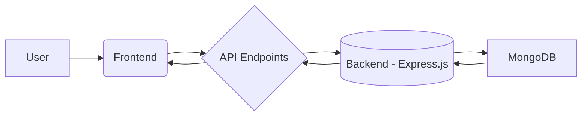

**Explanation:**

1.  **User:** Interacts with the frontend.
2.  **Frontend:** Sends requests to the API endpoints.
3.  **API Endpoints:** Defined in the backend.
4.  **Backend:** Processes requests, interacts with the database.
5.  **MongoDB:** Stores and retrieves data.

### 3. Component Breakdown

#### 3.1. Frontend Components

*   **`apis.tsx`:** Defines the API endpoint URLs used by the frontend.
*   **`username-input.tsx` (Signup):**  Handles username input during signup, using Recoil for state management.
*   **`email-input.tsx` (Signup):** Handles email input during signup, using Recoil for state management.
*   **`email-input.tsx` (Signin):** Handles email input during signin, using Recoil for state management.

#### 3.2. Backend Components

*   **`backend/routes/user/user.ts`:** Defines the user-related API routes (signup, signin, space management).
*   **`backend/routes/mainRoute.ts`:**  Aggregates all routes, including the user routes.

### 4. Key Workflows and Data Flows

#### 4.1. User Signup Workflow

This workflow describes the steps involved in a user signing up for the StudySpace platform.

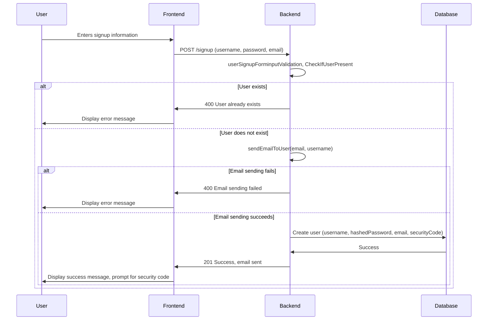

**Explanation:**

1.  The user enters their signup information on the frontend.
2.  The frontend sends a POST request to the `/signup` endpoint on the backend.
3.  The backend validates the input and checks if the user already exists.
4.  If the user exists, an error is returned.
5.  If the user doesn't exist, the backend attempts to send a security code to the user's email.
6.  If the email sending fails, an error is returned.
7.  If the email sending succeeds, the backend creates a new user in the database.
8.  The backend sends a success message to the frontend, prompting the user to enter the security code.

**Code Example (Backend - `user.ts`):**

```typescript
userRoute.post(
  "/signup",
  userSignupForminputValidation,
  CheckIfUserPresent,
  async (req: Request, res: Response) => {
    const { username, password, email } = req.body;
    try {
      const emailStatus = await sendEmailToUser(email, username);
      if (emailStatus.success) {
        const saltRounds = 10; // Use more rounds for better security
        const hashedPassword = await bcrypt.hash(password, saltRounds);
        await Users.create({
          Username: username,
          Password: hashedPassword,
          Email: email,
          SecurityCode: emailStatus.securityCode?.toString(),
        });
        res
          .status(201)
          .json({ msg: emailStatus.msg, success: emailStatus.success });
      } else {
        res
          .status(400)
          .json({ msg: emailStatus.msg, success: emailStatus.success });
      }
    } catch (error) {
      console.error("Error during signup:", error);
      res
        .status(500)
        .json({ message: "Internal server error", success: false });
    }
  }
);
```

#### 4.2. User Signin Workflow

This workflow outlines the steps for a user to sign in to the StudySpace platform.

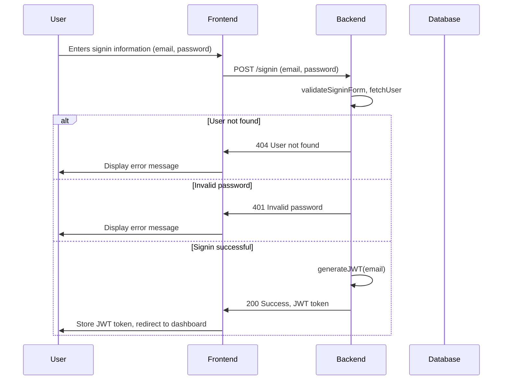

**Explanation:**

1.  The user enters their signin information (email and password) on the frontend.
2.  The frontend sends a POST request to the `/signin` endpoint on the backend.
3.  The backend validates the input and attempts to fetch the user from the database.
4.  If the user is not found, an error is returned.
5.  If the password is invalid, an error is returned.
6.  If the signin is successful, the backend generates a JWT token.
7.  The backend sends the JWT token to the frontend.
8.  The frontend stores the JWT token and redirects the user to the dashboard.

**Code Example (Backend - `user.ts`):**

```typescript
userRoute.post(
  "/signin",
  validateSigninForm,
  fetchUser,
  async (req: Request, res: Response) => {
    const { email, password } = req.body;
    try {
      const JWT_KEY = await generateJWT(email);
      res.json({
        token: JWT_KEY,
        success: true,
      });
    } catch (error) {
      console.error("Error during signin:", error);
      res.status(500).json({ msg: "Internal server error", success: false });
    }
  }
);
```

#### 4.3. Fetching Spaces Workflow

This workflow describes how a user retrieves available study spaces.

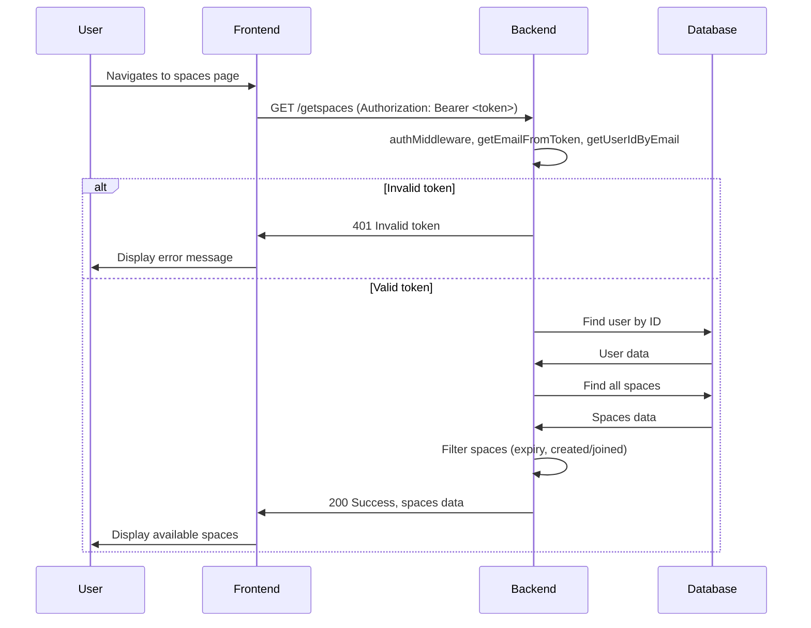

**Explanation:**

1.  The user navigates to the spaces page on the frontend.
2.  The frontend sends a GET request to the `/getspaces` endpoint on the backend, including the JWT token in the Authorization header.
3.  The backend authenticates the user using the `authMiddleware` and extracts the email and user ID from the token.
4.  If the token is invalid, an error is returned.
5.  If the token is valid, the backend retrieves the user from the database.
6.  The backend retrieves all spaces from the database.
7.  The backend filters the spaces based on expiry time and whether the user has created or joined them.
8.  The backend sends the filtered spaces data to the frontend.
9.  The frontend displays the available spaces to the user.

**Code Example (Backend - `user.ts`):**

```typescript
userRoute.get(
  "/getspaces",
  authMiddleware,
  async (req: Request, res: Response) => {
    const authorization = req.headers.authorization;
    if (!authorization) {
      return res.status(401).json({
        msg: "Fatal: Missing Authorization header",
      });
    }
    try {
      const email = await getEmailFromToken(authorization);
      const user_Id = await getUserIdByEmail(email);

      const user = await Users.findOne({
        _id: user_Id,
      });

      const spaces = await Spaces.find();

      // Filter out expired spaces and those the user has created or joined
      const updatedSpaces = spaces
        .filter((space) => {
          const currentTime = new Date();
          const spaceExpiryTime = new Date(space.Expiry);
          return (
            currentTime <= spaceExpiryTime && // Only include spaces that have not expired
            !user?.SpacesCreated?.includes(space._id) && // Exclude spaces the user created
            !user?.SpacesJoined?.includes(space._id) // Exclude spaces the user joined
          );
        })
        .map((space) => ({
          ...space.toObject(),
          isJoined: user?.SpacesJoined?.includes(space._id), // Add isJoined flag
        }));

      res.json({
        spaces: updatedSpaces,
        success: true,
      });
    } catch (error) {
      console.error("Error getting spaces:", error);
      res.status(500).json({ msg: "Internal server error", success: false });
    }
  }
);
```

### 5. Practical Usage Guide

#### 5.1. Frontend Integration

To integrate the frontend with the API, use the constants defined in `apis.tsx` for the endpoint URLs. For example:

```typescript
import { USER_SIGNUP_API } from "./apis";

async function signupUser(userData: any) {
  const response = await fetch(USER_SIGNUP_API, {
    method: "POST",
    headers: {
      "Content-Type": "application/json",
    },
    body: JSON.stringify(userData),
  });
  const data = await response.json();
  return data;
}
```

#### 5.2. Backend Route Handling

The `userRoute` in `user.ts` handles all user-related API requests.  It utilizes middleware for authentication, validation, and data processing.

```typescript
import { userRoute } from "./user/user";
import express from "express";

const app = express();
app.use(express.json());
app.use("/api/v1/user", userRoute);
```

### 6. Implementation Details and Gotchas

*   **JWT Authentication:** The backend uses JWTs for authentication. Ensure the `JWT_KEY` environment variable is set.
*   **Password Hashing:** Passwords are hashed using bcrypt with a salt round of 10.
*   **Error Handling:**  The backend provides comprehensive error handling, returning appropriate status codes and messages.
*   **CORS:** Configure CORS appropriately to allow requests from the frontend domain.

### 7. Common Issues and Troubleshooting

*   **"Fatal: Missing Authorization header":**  Ensure the `Authorization` header is included in requests that require authentication.
*   **"Invalid or expired token":**  The JWT token may be invalid or expired.  Re-authenticate the user to obtain a new token.
*   **"Internal server error":** Check the backend logs for detailed error messages.

### 8. Advanced Configuration and Customization Options

*   **Email Service:** The email service used for sending security codes can be configured by modifying the `sendEmailToUser` function in `signUpAuthHelpers.ts` (not provided in the initial files, but assumed to exist based on usage).
*   **JWT Expiration:** The JWT expiration time can be adjusted in the `generateJWT` function in `signInAuthHelpers.ts` (not provided in the initial files, but assumed to exist based on usage).
*   **Database Configuration:** The MongoDB connection string can be configured via environment variables.

### 9. Performance Considerations and Optimization Strategies

*   **Database Indexing:** Ensure appropriate indexes are created on frequently queried fields in the MongoDB database.
*   **Caching:** Implement caching for frequently accessed data to reduce database load.
*   **Load Balancing:** Use a load balancer to distribute traffic across multiple backend instances.

### 10. Security Implications and Best Practices

*   **Input Validation:**  Thoroughly validate all user inputs to prevent injection attacks.
*   **Rate Limiting:** Implement rate limiting to prevent abuse of the API.
*   **HTTPS:**  Always use HTTPS to encrypt communication between the frontend and backend.
*   **CORS:** Configure CORS to only allow requests from trusted domains.
*   **Regular Security Audits:** Conduct regular security audits to identify and address potential vulnerabilities.

  ## Joined Spaces System Documentation

This document provides a comprehensive overview of the Joined Spaces system, focusing on the `JoinedSpaces.tsx` component. This system allows users to view spaces they have joined, fetching this information from an API and displaying it using React components.

### Overview

The Joined Spaces system is a crucial part of the application, providing users with a personalized view of the spaces they are actively participating in. It enhances user engagement by presenting relevant content and facilitating easy access to joined spaces. The `JoinedSpaces.tsx` component is responsible for fetching the space data, managing the state, and rendering the UI.

### Technical Architecture

The `JoinedSpaces.tsx` component relies on the following technologies and components:

*   **React:** For building the user interface.
*   **Recoil:** For managing the global state of joined spaces.
*   **`SpaceComp`:** A component (likely from `../Home/components/Spaces/space-component`) used to display individual space details.
*   **`JOINED_SPACES_API`:** An API endpoint (defined in `../apis/apis`) that provides the joined spaces data.
*   **Lazy-loaded components:** `Heading`, `Navbar`, and `Topbar` are lazy-loaded to improve initial page load performance.

**Component Relationships:**

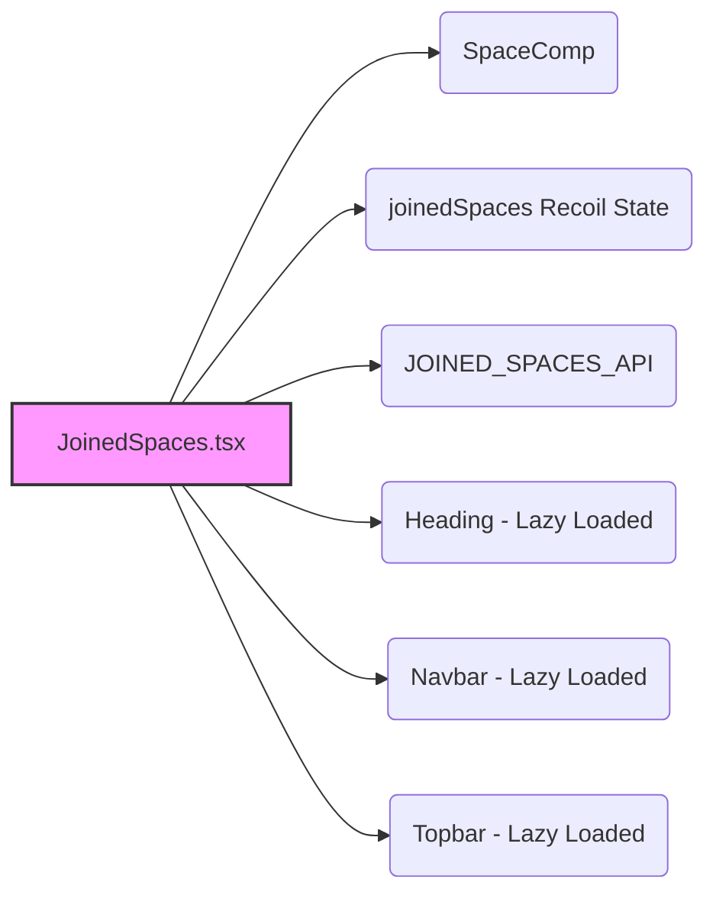

**Explanation:**

*   `JoinedSpaces.tsx` is the central component.
*   It utilizes `SpaceComp` to render individual spaces.
*   It interacts with the `joinedSpaces` Recoil state to manage the list of spaces.
*   It fetches data from the `JOINED_SPACES_API`.
*   It uses lazy-loaded components for the header, navigation bar, and top bar.

### Workflow and Data Flow: Fetching and Rendering Joined Spaces

The primary workflow involves fetching joined spaces data from the API and rendering them on the page.

1.  **Component Mount:** When the `Joinedspaces` component mounts, the `useEffect` hook is triggered.
2.  **Token Retrieval:** The `useEffect` hook attempts to retrieve the user's authentication token from `localStorage`.
3.  **API Request:** If a token is found, a `GET` request is made to the `JOINED_SPACES_API` endpoint, including the token in the `Authorization` header.
4.  **Data Processing:** The API response is parsed as JSON. The component expects a `spaceDetails` property in the response, which should be an array of `Space` objects.
5.  **State Update:** The `SetSpaces` function (obtained from `useRecoilState`) is used to update the `joinedSpaces` Recoil state with the fetched `spaceDetails`.
6.  **Rendering:** The component iterates over the `Spaces` array (obtained from `useRecoilState`) and renders a `SpaceComp` component for each space.
7.  **Error Handling:** If any error occurs during the process (e.g., no token found, API request fails, unexpected response format), an error message is set in the component's local state using `setError`.

**Workflow Visualization:**

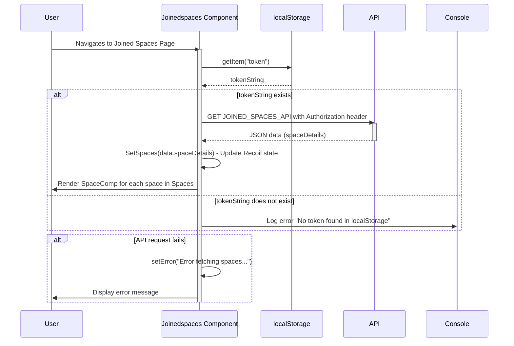

**Explanation:**

This diagram illustrates the sequence of events when a user navigates to the Joined Spaces page. It shows how the component retrieves the token, makes an API request, updates the Recoil state, and renders the spaces. It also highlights the error handling paths.

### Code Examples

**Fetching and Setting Spaces:**

```typescript
  useEffect(() => {
    const getSpaces = async () => {
      try {
        const tokenString = localStorage.getItem("token");
        if (!tokenString) {
          console.error("No token found in localStorage");
          return;
        }
        const token = JSON.parse(tokenString);

        const res = await fetch(JOINED_SPACES_API, {
          method: "GET",
          headers: {
            "Content-Type": "application/json",
            Authorization: `Bearer ${token}`,
          },
        });
        if (!res.ok) {
          throw new Error(`HTTP error! Status: ${res.status}`);
        }
        const data = await res.json();
        if (data.spaceDetails) {
          SetSpaces(data.spaceDetails); // Update Recoil state with fetched spaces
        } else {
          throw new Error("Unexpected response format");
        }
      } catch (error) {
        console.error("Error fetching spaces:", error);
        setError("Error fetching spaces. Please try again later.");
      }
    };

    getSpaces();
  }, [SetSpaces]); // Dependency array includes SetSpaces to avoid stale closure
```

**Rendering Spaces:**

```typescript
        {Spaces.map((space) => (
          <SpaceComp
            key={space.id} // Assuming each space has a unique ID
            space={space}
          />
        ))}
```

### Usage Guide

To use the `Joinedspaces` component, simply render it within your application. Ensure that the user is authenticated and has a valid token stored in `localStorage`. The component will automatically fetch and display the joined spaces.

```typescript jsx
import Joinedspaces from "./JoinedSpaces";

function App() {
  return (
    <div>
      {/* Other components */}
      <Joinedspaces />
      {/* Other components */}
    </div>
  );
}

export default App;
```

### Implementation Details and Gotchas

*   **Token Management:** The component relies on the presence of a valid token in `localStorage`. Ensure that the token is properly managed by the authentication system.
*   **Error Handling:** The component includes basic error handling, but it may be necessary to implement more robust error handling based on the application's requirements.
*   **API Response Format:** The component expects a specific format for the API response (`{ spaceDetails: Space[] }`). Ensure that the API returns data in the expected format.
*   **Date Handling:** The code includes logic to handle potential differences in how `FromTime` and `ToTime` are stored (either as strings or Date objects). This is a crucial detail to ensure correct rendering of space times.

### Common Issues and Troubleshooting

*   **Spaces not loading:**
    *   Check if the user is authenticated and has a valid token in `localStorage`.
    *   Verify that the `JOINED_SPACES_API` endpoint is accessible and returns the expected data format.
    *   Inspect the browser console for any error messages.
*   **Incorrect space details:**
    *   Ensure that the `SpaceComp` component is correctly rendering the space data.
    *   Verify that the API is returning accurate space details.
*   **Error message "Error fetching spaces":**
    *   Check the browser console for more detailed error information.
    *   Verify that the API endpoint is functioning correctly.
    *   Check network connectivity.

### Advanced Configuration and Customization

*   **Customizing the `SpaceComp` component:** You can customize the appearance and behavior of the `SpaceComp` component to match the application's design.
*   **Implementing custom error handling:** You can implement custom error handling logic to provide more informative error messages or take specific actions based on the error type.
*   **Adding pagination:** If the user has a large number of joined spaces, you can add pagination to improve performance and user experience.

### Performance Considerations and Optimization Strategies

*   **Lazy Loading:** The use of React.lazy for `Heading`, `Navbar`, and `Topbar` improves initial load time.
*   **Memoization:** Consider memoizing the `SpaceComp` component to prevent unnecessary re-renders.
*   **Virtualization:** If the user has a very large number of joined spaces, consider using a virtualization library to improve rendering performance.

### Security Implications and Best Practices

*   **Token Security:** Store the authentication token securely in `localStorage` or a more secure storage mechanism (e.g., cookies with HttpOnly flag).
*   **API Security:** Ensure that the `JOINED_SPACES_API` endpoint is properly secured and requires authentication.
*   **Data Validation:** Validate the data returned by the API to prevent potential security vulnerabilities.

This documentation provides a comprehensive overview of the Joined Spaces system and the `JoinedSpaces.tsx` component. By understanding the architecture, workflow, and implementation details, developers can effectively maintain, extend, and troubleshoot this critical part of the application.

## Database Schema and Automated Expiry System

This document describes the database schema and the automated expiry mechanism for "Spaces" within the application. It covers the Mongoose schema definitions, the scheduled task for filtering expired spaces, and the timezone handling involved.

### Mongoose Schema Definitions

The `db.ts` file defines two Mongoose schemas: `UserSchema` and `SpacesSchema`. These schemas define the structure of the data stored in the MongoDB database.

#### User Schema (`UserSchema`)

The `UserSchema` defines the structure for user documents.

```typescript
const UserSchema = new mongoose.Schema({
  Username: { type: String, required: true },
  Email: { type: String, required: true, unique: true },
  Password: { type: String, required: true },
  SpacesCreated: { type: [mongoose.Schema.ObjectId], default: [] }, // Defining the type of elements in the array
  SpacesJoined: { type: [mongoose.Schema.ObjectId], default: [] }, // Defining the type of elements in the array
  SecurityCode: { type: String, required: true },
});
```

**Fields:**

*   `Username`:  The user's username (String, required).
*   `Email`: The user's email address (String, required, unique).
*   `Password`: The user's password (String, required).
*   `SpacesCreated`: An array of ObjectIds referencing the spaces created by the user. Defaults to an empty array.
*   `SpacesJoined`: An array of ObjectIds referencing the spaces joined by the user. Defaults to an empty array.
*   `SecurityCode`: A security code for user verification or password reset (String, required).

#### Spaces Schema (`SpacesSchema`)

The `SpacesSchema` defines the structure for space documents.  The provided code snippet is incomplete, so a complete example is assumed for demonstration purposes.

```typescript
const SpacesSchema = new mongoose.Schema({
  Title: { type: String, default: "Chilling Session", required: true },
  Description: { type: String, default: "Shorter description", required: true },
  FromTime: { type: Date, required: true },
  ToTime: { type: Date, required: true },
  isExpired: { type: Boolean, default: false },
  Creator: { type: mongoose.Schema.ObjectId, required: true, ref: 'User' },
  Participants: { type: [mongoose.Schema.ObjectId], default: [], ref: 'User' }
});
```

**Fields:**

*   `Title`: The title of the space (String, required, default: "Chilling Session").
*   `Description`: A description of the space (String, required, default: "Shorter description").
*   `FromTime`: The start time of the space (Date, required).
*   `ToTime`: The end time of the space (Date, required).
*   `isExpired`: A boolean indicating whether the space has expired (Boolean, default: false).
*   `Creator`: ObjectId referencing the user who created the space (ObjectId, required, ref: 'User').
*   `Participants`: An array of ObjectIds referencing the users participating in the space (Array of ObjectIds, default: [], ref: 'User').

#### Mongoose Models

The schemas are compiled into Mongoose models:

```typescript
export const Users = mongoose.model("User", UserSchema);
export const Spaces = mongoose.model("Space", SpacesSchema);
```

These models are used to interact with the database, allowing you to create, read, update, and delete user and space documents.

### Automated Space Expiry

The `db.ts` file includes functionality to automatically mark spaces as expired based on their `ToTime` field. This is achieved through the `filterSpaces` function.

#### `filterSpaces` Function

The `filterSpaces` function retrieves all non-expired spaces from the database and checks if their `ToTime` has passed. If a space has expired, it is marked as `isExpired: true`.

```typescript
const filterSpaces = async () => {
  try {
    const spaces = await Spaces.find({ isExpired: false });

    // Get current time in UTC and IST
    const nowUtc = new Date();
    const nowIst = convertToIST(nowUtc);

    let expiredSpacesCount = 0;
    const expiredSpaceIds: string[] = [];

    for (const space of spaces) {
      // Space end time in UTC

      const spaceEndTimeUtc = new Date(space.ToTime);

      console.log(`Current time (UTC): ${nowUtc.toISOString()}`);
      console.log(`Current time (IST): ${nowIst.toISOString()}`);
      console.log(`Space end time (UTC): ${spaceEndTimeUtc.toISOString()}`);

      // Check if the space has expired in UTC
      if (nowIst > spaceEndTimeUtc) {
        console.log(`Space ${space._id} has expired.`);
        expiredSpacesCount++;

        // Add space ID to array for bulk update (convert ObjectId to string)
        expiredSpaceIds.push(space._id.toString());
      } else {
        console.log(`Space ${space._id} has not expired yet.`);
      }
    }

    // Bulk update all expired spaces
    if (expiredSpaceIds.length > 0) {
      await Spaces.updateMany(
        { _id: { $in: expiredSpaceIds } },
        { $set: { isExpired: true } }
      );
      console.log(`${expiredSpacesCount} spaces marked as expired.`);
    } else {
      console.log("No spaces expired at this time.");
    }

    console.log(
      `${expiredSpacesCount} spaces have expired at ${nowUtc.toISOString()} (UTC) / ${nowIst.toISOString()} (IST).`
    );
  } catch (error) {
    console.error("Error filtering spaces:", error);
  }
};
```

**Workflow:**

1.  **Retrieve Non-Expired Spaces:**  The function queries the `Spaces` collection for documents where `isExpired` is `false`.
2.  **Timezone Conversion:** The current time is obtained in UTC and converted to IST (Indian Standard Time) using the `convertToIST` function.
3.  **Expiry Check:**  For each space, the `ToTime` is compared to the current time in IST.
4.  **Mark as Expired:** If the current time in IST is later than the space's `ToTime`, the space's ID is added to an array of expired space IDs.
5.  **Bulk Update:**  A bulk update operation is performed to set `isExpired` to `true` for all spaces in the expired space IDs array.
6.  **Logging:**  The function logs the number of expired spaces and the current time in UTC and IST.
7.  **Error Handling:**  Any errors during the process are caught and logged.

#### `convertToIST` Function

This function converts a UTC `Date` object to Indian Standard Time (IST).

```typescript
const convertToIST = (utcDate: Date) => {
  return new Date(utcDate.getTime() + (5 * 60 + 30) * 60000); // Add 5 hours 30 minutes in milliseconds
};
```

It achieves this by adding 5 hours and 30 minutes (in milliseconds) to the UTC timestamp.

#### Scheduling the `filterSpaces` Function

While the provided code snippet doesn't include the scheduling logic, it's likely that the `filterSpaces` function is intended to be run periodically using a scheduler like `node-schedule`.  A typical implementation would look like this:

```typescript
import schedule from 'node-schedule';

// Schedule the task to run every day at midnight IST
schedule.scheduleJob('0 0 * * *', async () => {
  console.log('Running filterSpaces job...');
  await filterSpaces();
  console.log('filterSpaces job completed.');
});
```

This example schedules the `filterSpaces` function to run every day at midnight IST.  The cron expression `'0 0 * * *'` specifies the schedule.

### Data Flow Diagram

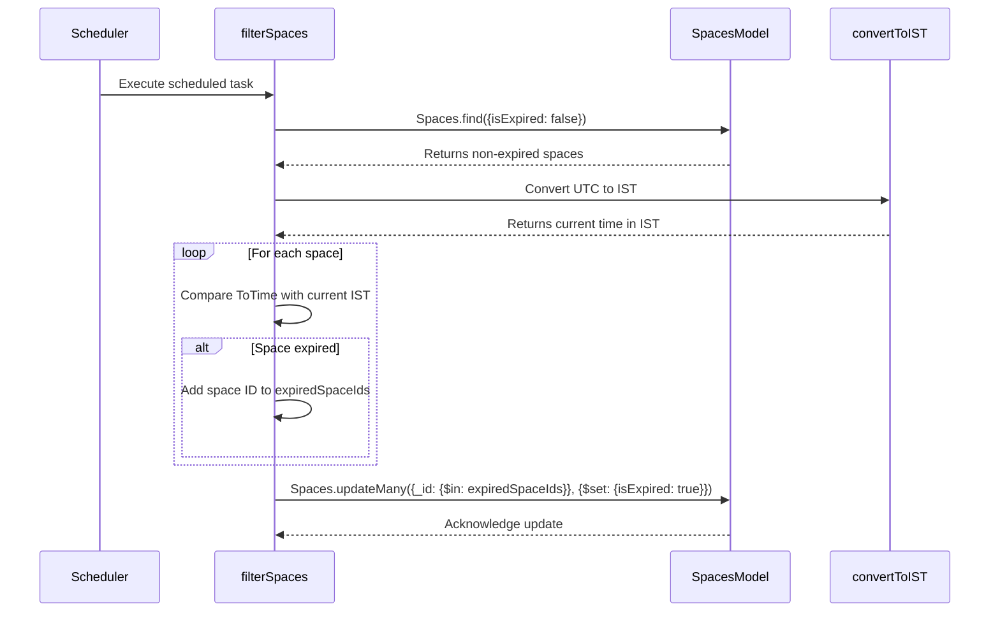

**Explanation:**

1.  The `Scheduler` triggers the `filterSpaces` function based on a defined schedule.
2.  `filterSpaces` retrieves non-expired spaces from the `Spaces` model.
3.  `filterSpaces` calls `convertToIST` to get the current time in IST.
4.  The function iterates through each space, comparing its `ToTime` with the current time in IST.
5.  If a space has expired, its ID is added to a list.
6.  Finally, `filterSpaces` updates all expired spaces in the database using `Spaces.updateMany`.

### Usage Examples

#### Creating a New Space

```typescript
import { Spaces } from './db';

async function createSpace(title: string, description: string, fromTime: Date, toTime: Date, creatorId: string) {
  try {
    const newSpace = new Spaces({
      Title: title,
      Description: description,
      FromTime: fromTime,
      ToTime: toTime,
      Creator: creatorId
    });

    const savedSpace = await newSpace.save();
    console.log('Space created:', savedSpace);
    return savedSpace;
  } catch (error) {
    console.error('Error creating space:', error);
    throw error;
  }
}

// Example usage:
const fromTime = new Date();
const toTime = new Date(Date.now() + 3600000); // 1 hour from now
createSpace("Meeting Room", "Discuss project updates", fromTime, toTime, "64f...");
```

#### Joining a Space

```typescript
import { Users, Spaces } from './db';
import mongoose from 'mongoose';

async function joinSpace(userId: string, spaceId: string) {
    try {
        // Validate that userId and spaceId are valid ObjectIds
        if (!mongoose.Types.ObjectId.isValid(userId) || !mongoose.Types.ObjectId.isValid(spaceId)) {
            throw new Error('Invalid userId or spaceId');
        }

        const user = await Users.findById(userId);
        const space = await Spaces.findById(spaceId);

        if (!user) {
            throw new Error('User not found');
        }

        if (!space) {
            throw new Error('Space not found');
        }

        // Add spaceId to user's SpacesJoined array if it's not already there
        if (!user.SpacesJoined.includes(spaceId)) {
            user.SpacesJoined.push(spaceId);
            await user.save();
        }

        // Optionally, add userId to space's Participants array (if it exists in the Spaces schema)
        if (space.Participants && !space.Participants.includes(userId)) {
            space.Participants.push(userId);
            await space.save();
        }

        console.log(`User ${userId} joined space ${spaceId}`);
    } catch (error) {
        console.error('Error joining space:', error);
        throw error;
    }
}

// Example Usage:
joinSpace("64f...", "650...");
```

### Important Implementation Details and Gotchas

*   **Timezone Handling:** The application uses IST for determining space expiry. Ensure that all date and time operations are consistently handled with respect to timezones to avoid unexpected behavior.  Storing dates in UTC in the database is generally recommended.
*   **Scheduler Configuration:**  The scheduling interval for `filterSpaces` should be carefully chosen.  Running it too frequently can put unnecessary load on the database.  Running it too infrequently may result in spaces remaining active for longer than intended.
*   **Error Handling:**  The `filterSpaces` function includes basic error handling, but more robust error handling and logging may be required in a production environment.  Consider implementing retry mechanisms for failed database operations.
*   **Database Performance:** For large datasets, consider optimizing the `Spaces.find` query in `filterSpaces` by adding indexes to the `isExpired` and `ToTime` fields.
*   **Data Consistency:** Ensure data consistency by using transactions when updating multiple documents related to a space (e.g., updating the space and related user documents).

### Common Issues and Troubleshooting

*   **Spaces not expiring:**
    *   Verify that the `filterSpaces` function is running correctly and is scheduled appropriately.
    *   Check the system's timezone settings to ensure they are configured correctly.
    *   Examine the logs for any errors during the expiry process.
    *   Confirm that the `ToTime` field in the database is being stored in UTC.
*   **Incorrect timezone conversions:**
    *   Double-check the `convertToIST` function to ensure that it is correctly adding the offset for IST.
    *   Use a library like `moment-timezone` for more robust timezone handling.
*   **Database connection errors:**
    *   Verify that the MongoDB connection string (`MONGO_URI`) is correct.
    *   Ensure that the MongoDB server is running and accessible.
    *   Check the database logs for any connection errors.

### Advanced Configuration and Customization Options

*   **Customizable Scheduling:**  Allow administrators to configure the scheduling interval for the `filterSpaces` function.
*   **Timezone Configuration:**  Provide a mechanism for configuring the application's timezone.  Store the timezone setting in a configuration file or database.
*   **Expiry Notification:**  Implement a notification system to alert users when their spaces are about to expire.
*   **Grace Period:**  Introduce a grace period before a space is marked as expired.  This can provide users with a buffer in case they need to extend the space's duration.

### Performance Considerations and Optimization Strategies

*   **Indexing:** Create indexes on the `isExpired` and `ToTime` fields in the `Spaces` collection to improve the performance of the `Spaces.find` query in `filterSpaces`.
*   **Query Optimization:**  Ensure that the `Spaces.find` query is using the appropriate indexes.  Use the `explain()` method to analyze the query execution plan.
*   **Caching:**  Consider caching frequently accessed data, such as space details, to reduce the load on the database.
*   **Database Sharding:**  For very large datasets, consider sharding the MongoDB database to distribute the data across multiple servers.

### Security Implications and Best Practices

*   **Input Validation:**  Validate all user inputs to prevent injection attacks.
*   **Authentication and Authorization:**  Implement robust authentication and authorization mechanisms to protect sensitive data.
*   **Data Encryption:**  Encrypt sensitive data, such as passwords, at rest and in transit.
*   **Regular Security Audits:**  Conduct regular security audits to identify and address potential vulnerabilities.
*   **Rate Limiting:** Implement rate limiting to prevent abuse and denial-of-service attacks.
*   **Protect API Keys:** Ensure that API keys and other sensitive credentials are not exposed in the codebase or configuration files. Use environment variables to store sensitive information.
